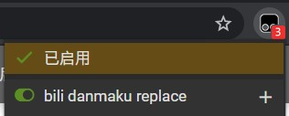
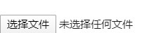

# 哔哩哔哩网页弹幕替换

## 使用方法
### 安装chrome扩展tampermonkey
点击[这个连接](https://github.com/lyineee/bili_danmaku_replace/raw/master/script.user.js)然后点击安装

### 确保脚本打开

### 打开一个视频，在右下角找到“选择文件”,选择弹幕文件

### **点击查看历史弹幕，随便选择其他日期的弹幕**

## 其他
因为这是随便写的，所以可能会有成吨的bug，将就着用吧ε=ε=ε=(~￣▽￣)~

